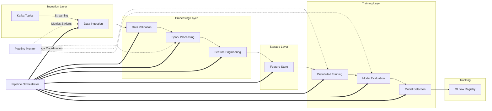
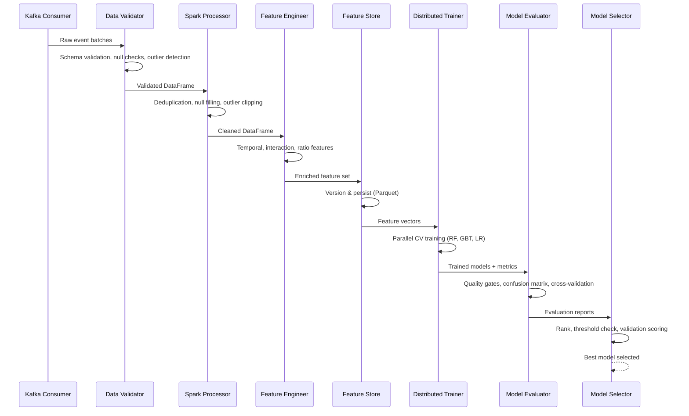
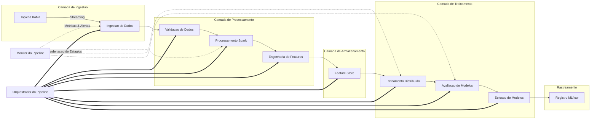
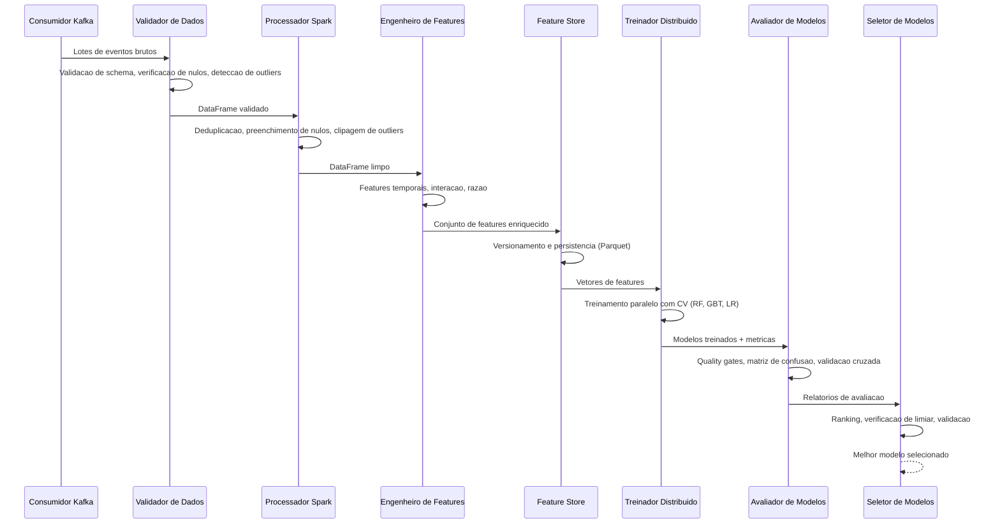

# Spark-Kafka ML Training Pipeline

**[English](#english) | [Portugues (BR)](#portugues-br)**

---

## English

### Overview

A production-grade distributed machine learning training pipeline built with Apache Spark, Apache Kafka, and scikit-learn. The system implements an end-to-end ML workflow from real-time data ingestion through model evaluation and selection, designed for high-throughput time-series and transactional data processing.

The pipeline features a modular architecture with pluggable components for each stage, supporting both distributed PySpark execution and standalone mode using pandas and concurrent.futures for development and testing without infrastructure dependencies.

### Architecture



### Pipeline Stages



### Key Features

- **Real-time ingestion** via Kafka Structured Streaming with schema registry integration
- **Rule-based data validation** with configurable severity levels and quality scoring
- **Distributed data processing** using Spark (or pandas for standalone mode)
- **Feature engineering** with temporal, window, lag, interaction, and ratio features
- **Versioned feature store** with metadata tracking and point-in-time retrieval
- **Parallel model training** using concurrent.futures with cross-validation
- **Quality gate evaluation** with configurable metric thresholds
- **Automated model selection** with ranking and baseline comparison
- **Pipeline orchestration** with stage dependencies and retry logic
- **Operational monitoring** with metric tracking, alerting, and health reports
- **MLflow integration** for experiment tracking and model registry

### Project Structure

```
spark-kafka-ml-training-pipeline/
├── config/
│   └── pipeline_config.yaml          # Pipeline configuration
├── docker/
│   ├── Dockerfile                    # Multi-stage production image
│   └── docker-compose.yml            # Kafka + Spark + App stack
├── src/
│   ├── config/
│   │   └── settings.py               # Dataclass-based configuration
│   ├── ingestion/
│   │   ├── kafka_consumer.py          # PySpark Kafka streaming reader
│   │   ├── kafka_consumer_simulator.py # Standalone Kafka simulator
│   │   ├── batch_loader.py            # Delta Lake batch loader
│   │   └── data_validator_standalone.py # Pandas-based data validator
│   ├── validation/
│   │   └── data_validator.py          # PySpark data validator
│   ├── processing/
│   │   ├── spark_processor.py         # Data cleaning and profiling
│   │   └── feature_engineering.py     # Feature transformations
│   ├── features/
│   │   ├── spark_features.py          # PySpark ML feature engine
│   │   └── feature_store.py           # Delta Lake feature store
│   ├── store/
│   │   └── feature_store.py           # Parquet-based feature store
│   ├── training/
│   │   ├── distributed_trainer.py     # PySpark ML trainer
│   │   ├── distributed_trainer_standalone.py # Concurrent trainer
│   │   ├── model_selector.py          # PySpark model selector
│   │   └── model_selector_standalone.py # Standalone model selector
│   ├── evaluation/
│   │   ├── evaluator.py               # PySpark evaluator
│   │   └── evaluator_standalone.py    # Sklearn evaluator
│   ├── orchestration/
│   │   ├── pipeline_orchestrator.py   # DAG-based orchestrator
│   │   └── pipeline.py                # Standalone orchestrator
│   ├── monitoring/
│   │   └── pipeline_monitor.py        # Metrics and alerting
│   └── utils/
│       └── logger.py                  # Centralized logging
├── tests/
│   ├── conftest.py                    # Shared fixtures
│   ├── test_kafka_consumer_simulator.py
│   ├── test_data_validator.py
│   ├── test_spark_processor.py
│   ├── test_feature_engineering.py
│   ├── test_feature_store.py
│   ├── test_distributed_trainer.py
│   ├── test_model_selector.py
│   ├── test_evaluator.py
│   ├── test_pipeline_orchestrator.py
│   └── test_pipeline_monitor.py
├── .github/
│   └── workflows/
│       └── ci.yml                     # CI/CD pipeline
├── main.py                            # Demo entry point
├── requirements.txt                   # Python dependencies
├── Makefile                           # Build automation
└── README.md                          # Documentation
```

### Technology Stack

| Component | Technology | Purpose |
|-----------|-----------|---------|
| Stream Processing | Apache Kafka + Confluent | Real-time event ingestion |
| Distributed Computing | Apache Spark 3.5 | Scalable data processing |
| Storage | Delta Lake | ACID transactional storage |
| ML Framework | scikit-learn | Model training and evaluation |
| Experiment Tracking | MLflow | Metrics, parameters, artifacts |
| Database | PostgreSQL | Metadata persistence |
| Containerization | Docker + Docker Compose | Infrastructure orchestration |
| CI/CD | GitHub Actions | Automated testing and builds |
| Language | Python 3.10+ | Core implementation |

### Quick Start

#### Prerequisites

- Python 3.10 or higher
- pip package manager

#### Installation

```bash
# Clone the repository
git clone https://github.com/galafis/spark-kafka-ml-training-pipeline.git
cd spark-kafka-ml-training-pipeline

# Install dependencies
make install

# Or manually
pip install -r requirements.txt
```

#### Running the Demo

The demo runs a complete fraud detection pipeline without requiring Spark or Kafka infrastructure:

```bash
# Default execution (5000 samples, 3 batches)
make run

# Small dataset for quick testing
make run-small

# Large dataset
make run-large

# Custom parameters
python main.py --samples 10000 --batches 5 --seed 42
```

#### Running with Docker

Full infrastructure deployment with Kafka, Spark, and the pipeline application:

```bash
# Build and start all services
make docker-build
make docker-up

# View logs
make docker-logs

# Stop services
make docker-down
```

#### Running Tests

```bash
# Run all tests
make test

# Run with coverage report
make test-cov

# Run linters
make lint
```

### Industry Applications

This pipeline architecture is designed for production ML workloads across multiple domains:

- **Financial Services**: Real-time fraud detection, credit scoring, anti-money laundering (AML), algorithmic risk assessment
- **E-commerce**: Customer behavior prediction, dynamic pricing, recommendation engines, demand forecasting
- **Healthcare**: Patient risk stratification, clinical outcome prediction, resource utilization optimization
- **IoT / Manufacturing**: Predictive maintenance, anomaly detection in sensor data, quality control
- **Telecommunications**: Network anomaly detection, churn prediction, traffic pattern analysis
- **Energy**: Load forecasting, grid stability prediction, renewable energy output optimization
- **Cybersecurity**: Intrusion detection, threat classification, behavioral analytics

### Configuration

Pipeline behavior is controlled via `config/pipeline_config.yaml`:

```yaml
spark:
  app_name: "spark-kafka-ml-pipeline"
  master: "local[*]"
  driver_memory: "4g"

kafka:
  bootstrap_servers: "localhost:9092"
  topics: ["ml-training-data"]
  auto_offset_reset: "earliest"

training:
  algorithms: ["random_forest", "gradient_boosted_trees", "logistic_regression"]
  primary_metric: "f1"
  cross_validation_folds: 5
  metric_threshold: 0.75
```

### License

This project is licensed under the MIT License.

### Author

**Gabriel Demetrios Lafis**

---

## Portugues BR

### Visao Geral

Um pipeline distribuido de treinamento de machine learning de nivel de producao, construido com Apache Spark, Apache Kafka e scikit-learn. O sistema implementa um fluxo de trabalho completo de ML, desde a ingestao de dados em tempo real ate a avaliacao e selecao de modelos, projetado para processamento de alto desempenho de series temporais e dados transacionais.

O pipeline possui uma arquitetura modular com componentes plugaveis para cada estagio, suportando tanto execucao distribuida com PySpark quanto modo standalone usando pandas e concurrent.futures para desenvolvimento e testes sem dependencias de infraestrutura.

### Arquitetura



### Estagios do Pipeline



### Funcionalidades Principais

- **Ingestao em tempo real** via Kafka Structured Streaming com integracao de schema registry
- **Validacao de dados baseada em regras** com niveis de severidade configuraveis e pontuacao de qualidade
- **Processamento distribuido de dados** usando Spark (ou pandas para modo standalone)
- **Engenharia de features** com features temporais, janela, lag, interacao e razao
- **Feature store versionado** com rastreamento de metadados e recuperacao point-in-time
- **Treinamento paralelo de modelos** usando concurrent.futures com validacao cruzada
- **Avaliacao com quality gates** com limiares de metricas configuraveis
- **Selecao automatizada de modelos** com ranking e comparacao com baseline
- **Orquestracao de pipeline** com dependencias entre estagios e logica de retry
- **Monitoramento operacional** com rastreamento de metricas, alertas e relatorios de saude
- **Integracao com MLflow** para rastreamento de experimentos e registro de modelos

### Stack Tecnologica

| Componente | Tecnologia | Proposito |
|-----------|-----------|---------|
| Processamento de Streams | Apache Kafka + Confluent | Ingestao de eventos em tempo real |
| Computacao Distribuida | Apache Spark 3.5 | Processamento escalavel de dados |
| Armazenamento | Delta Lake | Armazenamento transacional ACID |
| Framework de ML | scikit-learn | Treinamento e avaliacao de modelos |
| Rastreamento de Experimentos | MLflow | Metricas, parametros, artefatos |
| Banco de Dados | PostgreSQL | Persistencia de metadados |
| Containerizacao | Docker + Docker Compose | Orquestracao de infraestrutura |
| CI/CD | GitHub Actions | Testes e builds automatizados |
| Linguagem | Python 3.10+ | Implementacao principal |

### Inicio Rapido

#### Pre-requisitos

- Python 3.10 ou superior
- Gerenciador de pacotes pip

#### Instalacao

```bash
# Clonar o repositorio
git clone https://github.com/galafis/spark-kafka-ml-training-pipeline.git
cd spark-kafka-ml-training-pipeline

# Instalar dependencias
make install

# Ou manualmente
pip install -r requirements.txt
```

#### Executando a Demo

A demo executa um pipeline completo de deteccao de fraude sem necessidade de infraestrutura Spark ou Kafka:

```bash
# Execucao padrao (5000 amostras, 3 lotes)
make run

# Dataset pequeno para teste rapido
make run-small

# Dataset grande
make run-large

# Parametros customizados
python main.py --samples 10000 --batches 5 --seed 42
```

#### Executando com Docker

Deploy completo da infraestrutura com Kafka, Spark e a aplicacao do pipeline:

```bash
# Construir e iniciar todos os servicos
make docker-build
make docker-up

# Visualizar logs
make docker-logs

# Parar servicos
make docker-down
```

#### Executando Testes

```bash
# Executar todos os testes
make test

# Executar com relatorio de cobertura
make test-cov

# Executar linters
make lint
```

### Aplicacoes na Industria

Esta arquitetura de pipeline e projetada para cargas de trabalho de ML em producao em multiplos dominios:

- **Servicos Financeiros**: Deteccao de fraude em tempo real, credit scoring, prevencao a lavagem de dinheiro (AML), avaliacao algoritmica de risco
- **E-commerce**: Predicao de comportamento do cliente, precificacao dinamica, motores de recomendacao, previsao de demanda
- **Saude**: Estratificacao de risco do paciente, predicao de resultados clinicos, otimizacao da utilizacao de recursos
- **IoT / Manufatura**: Manutencao preditiva, deteccao de anomalias em dados de sensores, controle de qualidade
- **Telecomunicacoes**: Deteccao de anomalias de rede, predicao de churn, analise de padroes de trafego
- **Energia**: Previsao de carga, predicao de estabilidade da rede, otimizacao da producao de energia renovavel
- **Ciberseguranca**: Deteccao de intrusao, classificacao de ameacas, analitica comportamental

### Configuracao

O comportamento do pipeline e controlado via `config/pipeline_config.yaml`:

```yaml
spark:
  app_name: "spark-kafka-ml-pipeline"
  master: "local[*]"
  driver_memory: "4g"

kafka:
  bootstrap_servers: "localhost:9092"
  topics: ["ml-training-data"]
  auto_offset_reset: "earliest"

training:
  algorithms: ["random_forest", "gradient_boosted_trees", "logistic_regression"]
  primary_metric: "f1"
  cross_validation_folds: 5
  metric_threshold: 0.75
```

### Licenca

Este projeto esta licenciado sob a Licenca MIT.

### Autor

**Gabriel Demetrios Lafis**
